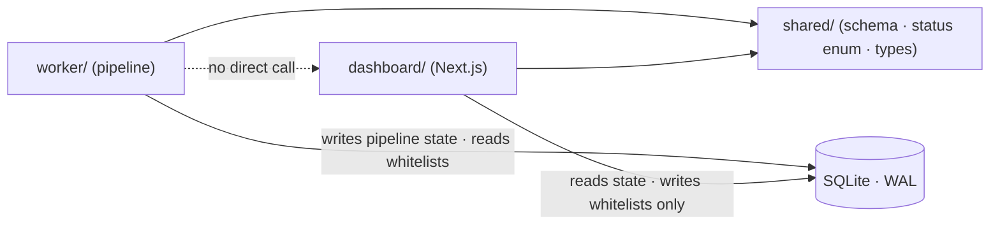
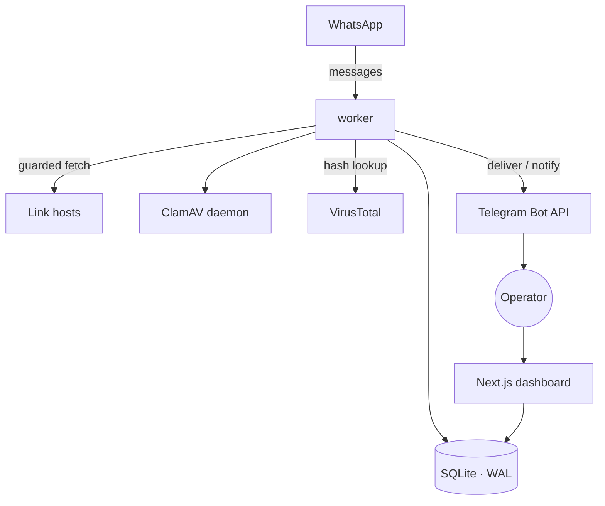
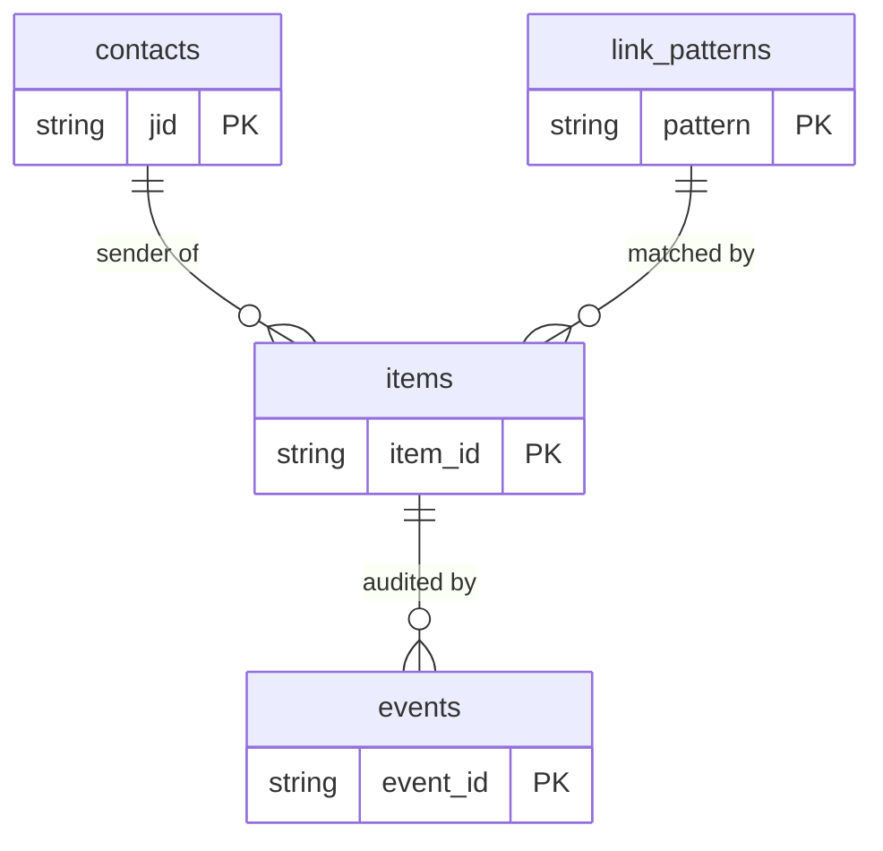

# Architecture Spine — WhatsApp Downloader

## Design Paradigm

**Pipes-and-filters pipeline** (the worker) behind a **shared-database integration** with a read-mostly **dashboard**. Two OS processes, one SQLite file as the only seam.

- **Worker** — an event-driven pipeline: each incoming WhatsApp message flows through ordered filters (gate → validate → dedup → fetch → scan → extract → file → notify), each filter advancing an item's status or dropping it. Sole owner of side effects (network, filesystem, scanning, Telegram) and sole writer of pipeline state.
- **Dashboard** — a Next.js app that reads pipeline state and writes *only* operator whitelists. It renders; it does not run the pipeline.
- **Seam** — the SQLite file. No HTTP/IPC/socket between the two processes.

Directory mapping: `worker/` = the pipeline + filters; `dashboard/` = the Next.js UI; `shared/` = schema, migrations, status enum, and shared TS types both sides import.

## Invariants & Rules

### AD-1 — Two-process boundary, SQLite is the only seam `[ADOPTED]`
- **Binds:** all
- **Prevents:** a hidden HTTP/IPC coupling that entangles worker and dashboard or requires co-deployment.
- **Rule:** worker and dashboard never call each other by any transport; all cross-process data passes through the shared SQLite file.

### AD-2 — Single writer per data domain `[ADOPTED]`
- **Binds:** all persisted state
- **Prevents:** two writers racing the same rows; ambiguous ownership.
- **Rule:** the **worker** is the sole writer of pipeline state — the `items` and `events` tables (AD-14) and the worker-owned auth store (AD-9). The **dashboard** writes **only** the `contacts` and `link_patterns` tables. Neither writes the other's domain. The worker reads the whitelist tables **fresh per message** and never caches them across messages (FR-11).

### AD-3 — SQLite in WAL mode, bounded waits
- **Binds:** every DB connection
- **Prevents:** `SQLITE_BUSY` failures and lost writes under worker↔dashboard contention.
- **Rule:** open the DB in WAL journal mode with `busy_timeout` set on **every** connection, including the dashboard's whitelist writes. SQLite's write lock is per-**file**, not per-table, so the single-writer-per-domain split (AD-2) does not remove file-level contention — every write path must tolerate and retry `SQLITE_BUSY`.

### AD-4 — Worker owns the schema
- **Binds:** schema, migrations
- **Prevents:** two components applying incompatible DDL to one file.
- **Rule:** the worker runs versioned migrations at startup and is the only component that issues DDL; the dashboard treats the schema as a read-only contract and never migrates or alters it.

### AD-5 — The pipeline is an explicit state machine
- **Binds:** FR-1..FR-10, FR-16..FR-18; dashboard status display (FR-13)
- **Prevents:** ad-hoc status strings, items stuck in ambiguous states, worker and dashboard interpreting "done" differently.
- **Rule:** every item (one `items` row, AD-14) holds exactly one `status` from the fixed enum below; transitions are one-directional toward a terminal state; the enum lives in `shared/` and both processes import it — no side invents a status. **Delivery is not a status** — a file reaching the Final store is `stored`; whether it was also sent over Telegram is a separate Event (AD-11).
  - Non-terminal: `received → validating → downloading → scanning → extracting`.
  - Terminal: `ignored`, `duplicate`, `rejected`, `failed`, `quarantined`, `stored`.

### AD-6 — Fail-closed is the default transition
- **Binds:** FR-6, FR-7, FR-16, FR-17
- **Prevents:** a newly added pipeline step defaulting to "pass" on error.
- **Rule:** any exception, timeout, or uncertain outcome transitions the item **away** from the Final store (→ `quarantined`/`rejected`/`failed`), never toward it. Only an explicit positive scan result advances an item to `delivered`/`stored`.

### AD-7 — Filesystem layout carries state
- **Binds:** FR-5, FR-6, FR-7, FR-8
- **Prevents:** the worker and any mover/cleanup code disagreeing on where a file lives for a given status.
- **Rule:** `staging/`, `final/`, `quarantine/`, and `extract/` (isolated) are distinct roots; a file's directory must match its DB `status`; moves are atomic renames. The move and the status write follow a **fixed order** — atomically rename into the destination root first, then commit the status — and a crash in the gap is repaired fail-closed by startup reconciliation (AD-15). A file is never in `final/` without a recorded passed scan.

### AD-8 — One guarded fetcher
- **Binds:** FR-2, FR-3, FR-16
- **Prevents:** a second code path fetching a URL without SSRF/redirect/size guards.
- **Rule:** all outbound content fetches go through a single fetch component that resolves-and-pins the target IP, blocks private/reserved ranges, re-applies the link-pattern gate on **every** redirect hop, and enforces the size cap as a streaming abort. No raw HTTP client is used for content elsewhere.

### AD-9 — Secrets and session are worker-owned and out of the DB
- **Binds:** all
- **Prevents:** the dashboard touching session/secrets; credentials leaking into the DB or code.
- **Rule:** all secrets load from a gitignored `.env`; Baileys auth state uses a dedicated store (**not** `useMultiFileAuthState`) owned solely by the worker; neither secrets nor session bytes live in the shared SQLite tables the dashboard reads.

### AD-10 — Dedup identity
- **Binds:** FR-4
- **Prevents:** a resent link or a worker restart causing a re-download / re-delivery.
- **Rule:** dedup uses two keys — a **pre-download** normalized-URL hash checked at the gate to skip re-fetching an already-processed link, and a **post-download** content SHA-256 to catch identical bytes arriving from different URLs. Both are recorded on the `items` row; a hit short-circuits to `duplicate`. `[ASSUMPTION: a re-sent URL never re-fetches — confirm, in case linked content legitimately changes]`

### AD-11 — Notification is a terminal side effect
- **Binds:** FR-9, FR-10
- **Prevents:** a Telegram failure corrupting pipeline state or reversing a transition.
- **Rule:** Telegram delivery fires only at a terminal transition; a send failure is recorded as an Event and surfaced, but never blocks, retries into, or reverses a state transition.

### AD-12 — Link-pattern grammar is closed
- **Binds:** FR-2
- **Prevents:** an over-permissive operator pattern acting as a wildcard bypass.
- **Rule:** patterns are exact-domain (with optional path prefix) and/or an extension allowlist — no regex, no wildcard TLDs, no substring matching. The matcher is a **single shared module** used identically by the initial gate and the per-redirect re-check (AD-8); the two never carry separate implementations. `[resolves OQ-11]`

### AD-13 — Bounded concurrency
- **Binds:** FR-3, FR-5; NFR resource use
- **Prevents:** many simultaneous large downloads exhausting disk/CPU, or a sender flooding the pipeline.
- **Rule:** the worker processes downloads through a bounded queue (max concurrent downloads + a per-sender rate cap); overflow queues rather than runs. `[ASSUMPTION: default max-concurrent=2 — tune at build]`

### AD-14 — The shared data contract is pinned, not just named
- **Binds:** the SQLite seam; worker writers and dashboard readers
- **Prevents:** the worker writing a row shape the dashboard reads differently — the deepest divergence, since the DB is the only seam (AD-1).
- **Rule:** the seam is these tables, defined once in `shared/` migrations:
  - **`items`** — one row per ingested candidate, PK `item_id` (UUIDv4). Holds the single `status` (AD-5), `sender_jid`, `source_url`, `url_hash` (pre-download dedup), `content_sha256` (nullable until downloaded), `filename`, `size_bytes`, `scan_result`, `created_at`, `updated_at`. **This row is the single status holder.**
  - **`events`** — append-only audit log, PK `event_id` (UUIDv4), FK `item_id`, `event_type`, `detail`, `created_at`. Many events per item; rows are never updated.
  - **`contacts`**, **`link_patterns`** — operator whitelists (dashboard-writable, AD-2).
  - Baileys auth state is **not** in this DB (AD-9) — it is a separate worker-owned store.

### AD-15 — Fail-closed startup reconciliation
- **Binds:** worker startup; AD-5, AD-6, AD-7, AD-13
- **Prevents:** a crash mid-pipeline leaving an item stuck non-terminal, or a file whose directory and DB status disagree, being silently trusted.
- **Rule:** on start, the worker reconciles every non-terminal `items` row and every file against AD-7's dir↔status invariant. Any mismatch or in-flight item is resolved **fail-closed** — re-queued from a safe earlier stage or moved to `quarantine`, never advanced. The bounded queue (AD-13) is rebuilt from `items` status on start, not held only in memory.

### AD-16 — Operational envelope
- **Binds:** deployment, durability
- **Prevents:** the always-on worker dying silently, or the source-of-truth data being unrecoverable — dimensions a pipeline-focused design leaves silent.
- **Rule:** the worker runs under a process supervisor that auto-restarts it (safe resume via AD-15); the SQLite file and the `final/` store are backed up on a schedule; the `events` log has a defined retention. Concrete supervisor, backup cadence, and retention window are pilot-tunable (see Deferred).

### Dependency direction



## Consistency Conventions

| Concern | Convention |
| --- | --- |
| Naming | DB tables/columns `snake_case`; TS `camelCase`; status enum values are the lowercase terminals/non-terminals in AD-5, defined once in `shared/`. |
| Identifiers | Event id = UUIDv4; WhatsApp sender identity = normalized Baileys JID; file dedup key = `sha256` hex (AD-10). |
| Time | All timestamps ISO-8601 UTC. |
| Errors & logging | Every pipeline outcome (advance, drop, fail) is written as one structured Event row (AD-5); the Event log is the audit trail — no outcome is logged only to stdout. |
| Config | All environment/secret values from `.env` (AD-9); no hardcoded tokens, numbers, or paths — caps/thresholds are config keys. |
| Auth (dashboard) | Local-only, no exposed auth in v1 (Non-Goal); the dashboard binds to localhost. |

## Stack

| Name | Version |
| --- | --- |
| Node.js | 24 LTS |
| TypeScript | 5.9 (6.0 is GA; deferring) |
| Baileys | 6.7.x — npm package `baileys` (unscoped), stable line; **not** 7.0.0-rc `[ASSUMPTION]` |
| Next.js | 16.2.x (LTS 16) |
| better-sqlite3 | 12.11.x (≥12 required for Node 24 prebuilt binaries — do not downgrade) |
| Tailwind CSS v4 + shadcn/ui | current (React 19 / Next 16 ready) |
| qrcode | 1.5.4 (re-pair QR image, FR-14) |
| clamscan (ClamAV client) | 2.4.0 — ClamAV daemon is a system dependency |
| file-type | 22.x — **pure ESM**, so the worker is ESM (magic-byte classification, FR-18) |

VirusTotal (hash lookup) and Telegram Bot API are called over plain HTTPS `fetch` — no client library, no persistent connection.

## Structural Seed

```text
mini-project/
  worker/            # always-on process: Baileys session + the pipeline filters
    pipeline/        # one module per filter (gate, validate, dedup, fetch, scan, extract, deliver)
    fetcher/         # the single guarded fetch component (AD-8)
    scanner/         # ClamAV + VirusTotal adapters, fail-closed (AD-6)
  dashboard/         # Next.js app: reads state, manages whitelists (AD-2)
  shared/            # schema + migrations + status enum + TS types (imported by both)
  data/              # gitignored: staging/ final/ quarantine/ extract/ + baileys auth store
  .env               # gitignored secrets (AD-9)
```





*(Baileys auth state is a separate worker-owned store, not part of this shared schema — AD-9, AD-14.)*

## Capability → Architecture Map

| Capability / Area | Lives in | Governed by |
| --- | --- | --- |
| Ingestion & gatekeeping (FR-1, FR-2, FR-11) | `worker/pipeline` (gate) | AD-2, AD-5, AD-12 |
| Safe acquisition (FR-3, FR-4, FR-5, FR-16) | `worker/fetcher`, `worker/pipeline` | AD-8, AD-10, AD-13 |
| Scan / extract / quarantine (FR-6, FR-7, FR-8) | `worker/scanner`, `worker/pipeline` | AD-6, AD-7 |
| Delivery & notification (FR-9, FR-10) | `worker/pipeline` (deliver) | AD-11 |
| Dashboard & event log (FR-11, FR-12, FR-13, FR-14) | `dashboard/` | AD-1, AD-2, AD-4, AD-14 |
| Connection resilience (FR-15, FR-14) | `worker/` (session) | AD-9, AD-15 |
| Fail-safe & integrity (FR-17, FR-18) | `worker/pipeline`, `worker/scanner` | AD-6, AD-7, AD-15 |
| Operational (always-on, durability) | host / process supervisor | AD-16 |

## Deferred

- **Concrete policy values** — max download/uncompressed/file-count/nesting caps, redirect hop limit, scanner-signature freshness threshold, per-sender rate and max-concurrent numbers. Config keys (AD-13, conventions); tuned at build, not fixed here.
- **Reputation-outage policy** (hold vs. degrade to local-scan-only) — a config-driven branch in `worker/scanner`; default is fail-closed/hold (AD-6). PRD OQ-7.
- **Banned-number recovery** — operational procedure, not code (PRD OQ-9; addendum §F).
- **Multi-user, hosting, remote access, >50MB relay** — Non-Goals; no architecture until a v2 reopens them.
- **Migration tooling choice** — which migration runner the worker uses (AD-4 fixes ownership, not the tool).
- **Operational tuning** — the concrete process supervisor, backup cadence/target, and `events` retention window (AD-16 fixes that these exist, not their values).
